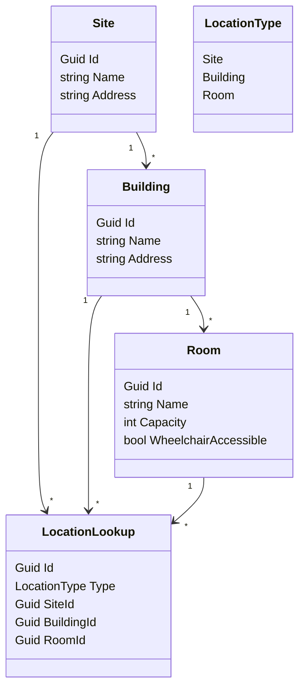
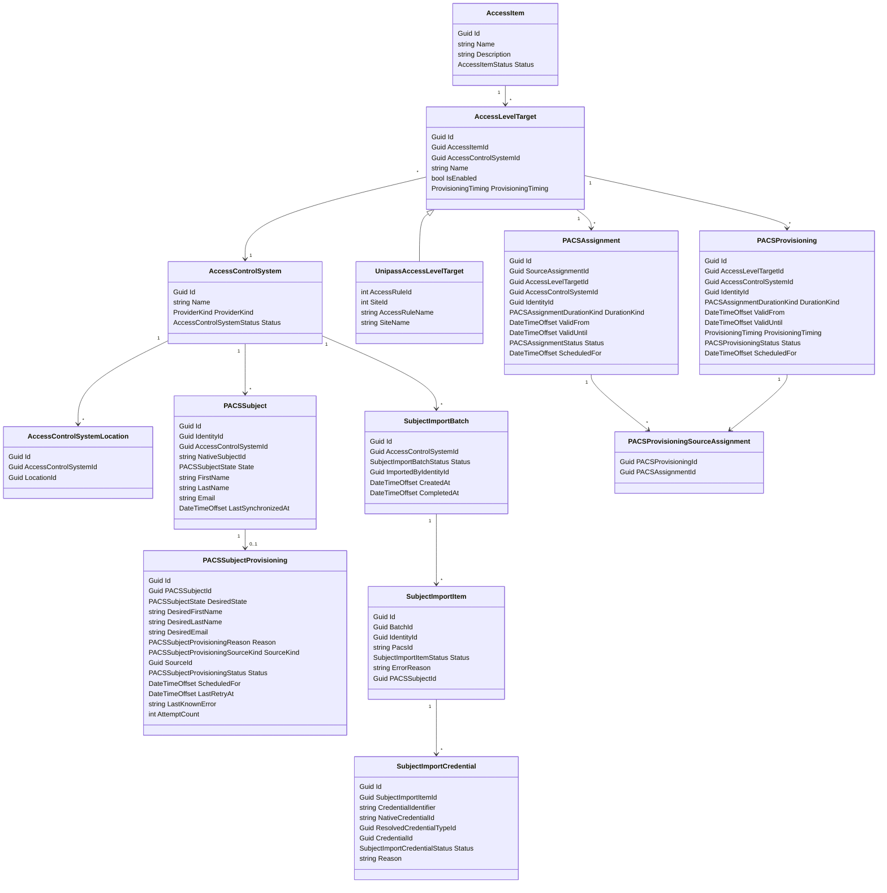
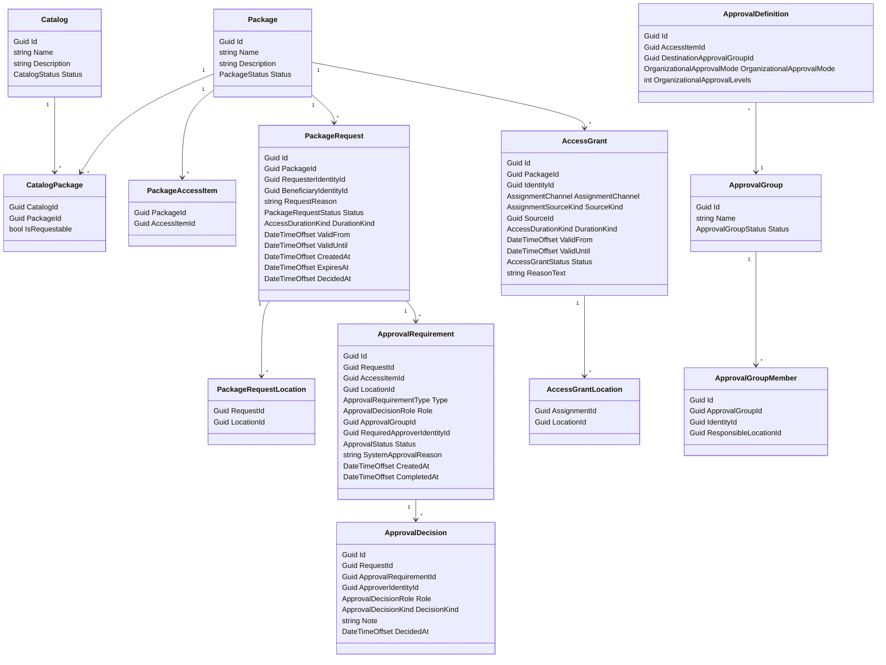
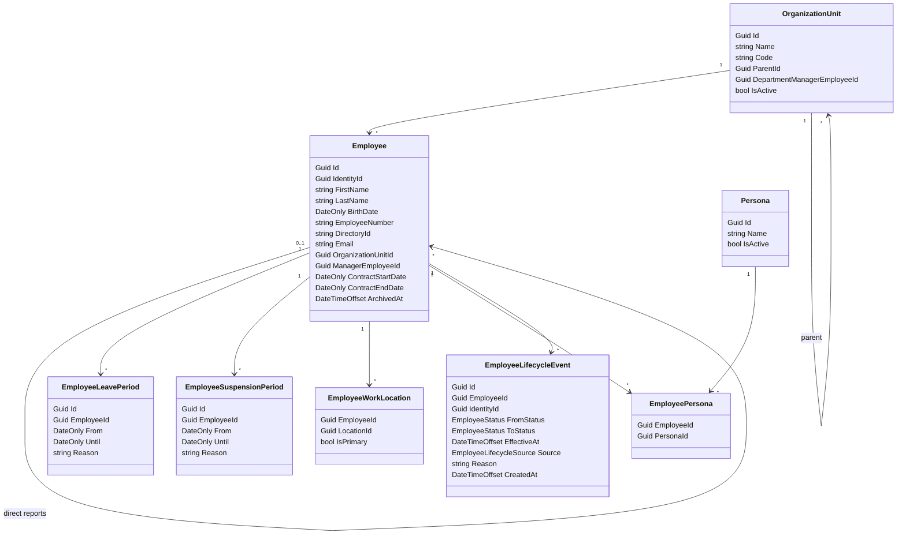
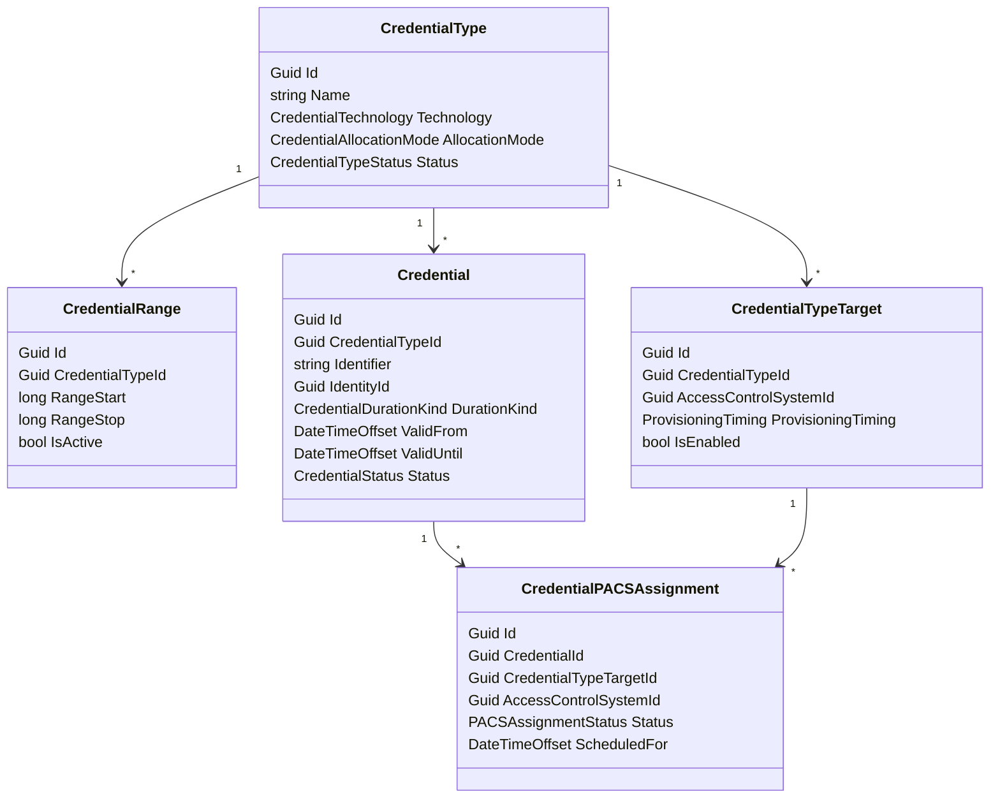

# Access Domain Bounded Contexts

This document summarizes the bounded-context split for locations, PACS access control, access catalog packages, automation/sagas, and credential management.

Updated ubiquitous language:

- `AccessItem`: our global business access concept, previously called Access Level.
- `Package`: the requestable business bundle, previously called Business Access Package.
- `AccessLevelTarget`: the native PACS access-level/access-rule mapping.
- `CredentialTypeTarget`: the native PACS credential-type/system mapping.
- `PACSAssignment`: the technical provisioning item, previously called provisioning transaction.

The core separation is:

- `Locations` owns where things are.
- `AccessControl` owns PACS infrastructure, access items, native PACS mappings, and technical PACS assignments.
- `AccessCatalog` owns catalogs, packages, requests, grants, approvals, and approval groups.
- `Employees` owns employee records, organization units, manager hierarchy, and calculated employee lifecycle.
- `CredentialManagement` owns credential types, numbers, issued credentials, and credential PACS assignments.
- Automation/saga contexts own cross-boundary rules such as OU-to-package or visitor-location-to-package.

## Locations

`Locations` is its own bounded context. It is a foundational physical hierarchy that other contexts reference by id, but it does not know about PACS, packages, approvals, visitors, employees, or credentials.

Current implementation has `Site`, `Building`, and `Room`. Conceptually, access scoping may also use `Zone` later.



Boundary rules:

- Locations owns the hierarchy and location metadata.
- Other contexts store `LocationId` references.
- Linking PACS to locations does not belong in Locations; it belongs in Access Control.

## Access Control

`AccessControl` owns the technical access-control catalog and PACS-native mappings.

`AccessControlSystem` represents a connected PACS, such as Unipass Belgium or Unipass France.

`AccessControlSystemLocation` links a PACS to the location scope it manages. It can point anywhere in the location tree.

Resolution rules:

- One location can be linked to zero or one PACS.
- One PACS can be linked to multiple locations.
- If a PACS is linked to a site, it covers child buildings and zones unless a child location has its own PACS link.
- Resolving PACS for a request location walks up the location tree and uses the nearest PACS link.
- If no PACS link is found for the request location or its ancestors, no PACS target can be selected.

`AccessItem` is a global business access concept, such as `Warehouse Access`.

`AccessLevelTarget` maps an access item to one or more native PACS access objects. For Unipass, a target maps to an access rule and site. It also defines technical provisioning timing such as eager provisioning or provisioning at valid-from.

`PACSAssignment` is the source technical assignment input for one `AccessGrant` reason. Multiple `PACSAssignment` rows can point to the same native PACS target for the same identity.

`PACSProvisioning` is the effective technical PACS row that should exist in the provider after reconciling all active `PACSAssignment` inputs for an identity and native target.

`PACSProvisioningSourceAssignment` links one effective `PACSProvisioning` row back to the contributing source `PACSAssignment` rows for full traceability.

`PACSSubject` is Fabric's minimal cardholder/person concept for one identity in one access-control system. It stores the last successfully synchronized representation that Fabric knows exists in that PACS.

`PACSSubjectProvisioning` is the latest desired update operation for a `PACSSubject`. It is operational state, not history. On successful provisioning, Fabric updates `PACSSubject` and deletes the provisioning row. If provisioning fails, Fabric keeps the provisioning row for retry and `PACSSubject` continues to reflect the last successfully synchronized representation.



Boundary rules:

- Access Control references locations by `LocationId`.
- Native PACS ids live on `AccessLevelTarget`, not on packages or access items.
- Provider-specific metadata lives in provider-specific target types.
- Access Control owns source PACS assignment inputs, effective PACS provisioning rows, and the reconciliation between them.
- Access Control owns PACS subject/cardholder projections and provisioning operations.
- Access Control owns PACS subject import batches and reports.
- Access Control does not own request approval or package request workflow.

Effective provisioning rules:

- `PACSAssignment` is a source row, not the final provider row.
- Effective provider state is represented by `PACSProvisioning`.
- Reconciliation groups source assignments by `IdentityId`, `AccessControlSystemId`, and native target (`AccessLevelTargetId`).
- If any grouped source assignment is permanent, the effective provisioning row is permanent.
- Temporary source assignments merge when their windows overlap or are adjacent.
- Disjoint temporary windows become multiple effective `PACSProvisioning` rows.
- `PACSProvisioningSourceAssignment` preserves traceability from an effective provider row back to the contributing source assignments.
- For Unipass permanent provisioning, no start time or end time is written. Temporary provisioning writes start and end times.

### Existing PACS Subject And Credential Onboarding

Most PACS systems are not empty when Fabric is introduced. For existing production PACS systems, Fabric should not guess cardholder links or create duplicate cardholders by default.

Safe onboarding procedure:

```text
1. Link HR/classifier to Fabric.
   Acceptance:
   - Employees exist in Fabric.
   - Employees have correct IdentityId.
   - Employees have correct personas.
   - Employees have correct OUs.
   - Employees have correct work locations.

2. Export cardholders from PACS.
   Include:
   - PACS primary id
   - display name or other human-readable matching fields

3. Export employees from Fabric.
   Include:
   - IdentityId
   - employee name
   - email
   - employee number
   - directory id
   - personas
   - OU
   - work locations

4. Create link CSV.
   Mandatory fields:
   - IdentityId
   - PacsId
   Optional credential fields:
   - CredentialIdentifier
   - NativeCredentialId

5. Configure/link PACS in Fabric.
   - Create AccessControlSystem.
   - Link PACS to locations.

6. Import CSV for that PACS.
   Fabric creates a SubjectImportBatch report.

7. Configure and enable package/access automation only after import succeeds.
```

`SubjectImportBatch` is the Access Control import root:

```text
SubjectImportBatch
- AccessControlSystemId
- Status
- ImportedByIdentityId
- CreatedAt
- CompletedAt
```

Each row creates a subject import item:

```text
SubjectImportItem
- IdentityId
- PacsId
- Status // Mapped, Error, Filtered
- ErrorReason?
- PACSSubjectId?
```

Each subject row can contain imported credentials:

```text
SubjectImportCredential
- CredentialIdentifier
- NativeCredentialId?
- ResolvedCredentialTypeId?
- CredentialId?
- Status // Imported, Unmapped, Conflict, Error
- Reason?
```

Successful subject rows create or link:

```text
PACSSubject
   - IdentityId
   - AccessControlSystemId
   - NativeSubjectId = PacsId
    - LinkSource = ManualImport

`PACSSubject` is Fabric's normalized subject model, not a byte-for-byte mirror of each PACS provider schema. It may contain fields such as `Email` even if a specific PACS cannot store or return that field.

Provider synchronization rules:

- `PACSSubject` is updated only after a successful provider sync or import.
- If a provider does not support one of Fabric's normalized subject fields, Fabric still keeps that field on `PACSSubject` and the provider adapter ignores it during sync.
- `PACSSubjectProvisioning` stores only the latest desired update per `PACSSubject`.
- Last writer wins: if a new desired update arrives while an older provisioning row is pending or failed, Fabric overwrites the existing provisioning row with the latest desired values.
- A failed `PACSSubjectProvisioning` means `PACSSubject` still reflects the last known successful PACS representation.
- Successful provisioning deletes the `PACSSubjectProvisioning` row.
```

Subject import validation:

- `IdentityId` exists.
- `PacsId` is present.
- `PacsId` is unique within the PACS.
- `IdentityId` is not already linked to another `PACSSubject` in the same PACS.
- `PacsId` is not already linked to another `IdentityId`.

Repeat imports:

- If the same `IdentityId` and `PacsId` mapping already exists, the row is `Filtered`.
- `Filtered` means no new mapping was created because the mapping already exists from a previous import or auto-create.
- If either side is linked to a different value, the row is `Error`, not `Filtered`.

Credential import behavior:

```text
For each successful SubjectImportItem:
- import credentials for that subject
- resolve candidate CredentialTypes through CredentialTypeTarget for the PACS
- if multiple CredentialTypes map to the same CredentialTypeTarget, reduce by CredentialRange when possible
- create managed Fabric Credential for mapped credentials
- create CredentialPACSAssignment or native credential link
- record unmapped, ambiguous, or conflicted credentials as SubjectImportCredential rows
```

Credential validation:

- `CredentialIdentifier` is present.
- `CredentialIdentifier` is tenant-globally unique.
- Candidate credential types are found from `CredentialTypeTarget` records that target the imported PACS.
- For range-allocated credential types, `CredentialIdentifier` parses as numeric and falls inside an active `CredentialRange`.
- If exactly one candidate credential type remains after target and range resolution, a managed Fabric credential can be created.
- If no candidate remains, the row is `Unmapped`.
- If multiple candidates remain, the row is `Ambiguous`.
- `NativeCredentialId` is not already linked, if provided.

Unmapped credentials:

```text
SubjectImportCredential
- Status: Unmapped
- Reason: OutsideCredentialTypeRanges
```

Ambiguous credentials:

```text
SubjectImportCredential
- Status: Ambiguous
- Reason: MultipleCredentialTypesMatched
```

Ambiguous rows are not imported as managed credentials automatically. Later, an operator can clarify the row from the import report by selecting the intended `CredentialType`. After clarification, Credential Management creates the managed credential if the identifier is still valid and unique.

A subject can be `Mapped` while one or more credentials are `Unmapped`. A subject with invalid `IdentityId` or `PacsId` is `Error`, and its credentials must not create managed Fabric credentials.

Credential ownership split:

- Access Control owns the import batch/report.
- Credential Management owns successful managed `Credential` records.
- Credential Management advances allocation state per range-allocated `CredentialType` to the highest successfully imported numeric identifier for that type.

Example report:

```text
SubjectImportBatch: PACS BE, CompletedWithErrors

SubjectImportItem: Identity Dimitar, PacsId 10001, Mapped
- SubjectImportCredential: 123456, CredentialType Employee Desfire, Imported
- SubjectImportCredential: 999999, Unmapped, OutsideCredentialTypeRanges
- SubjectImportCredential: 120000, Ambiguous, MultipleCredentialTypesMatched

SubjectImportItem: Identity Alice, PacsId 10002, Error
- ErrorReason: InvalidIdentityId

SubjectImportItem: Identity Sverre, PacsId 10003, Mapped
- SubjectImportCredential: 123900, CredentialType Employee Desfire, Imported

SubjectImportItem: Identity Kris, PacsId 10004, Filtered
- Reason: MappingAlreadyExists
```

After this import, PIAM can show imported PACS credentials as managed Fabric credentials for mapped employees, while unmapped credentials remain visible in the import report for follow-up.

## Access Catalog

`AccessCatalog` owns catalogs, packages, package requests, access grants, approvals, and approval governance.

It owns:

- catalogs
- requestable packages
- package-to-access-item composition
- package requests
- access grants
- approval groups and scoped approval group members
- approval requirements and decisions

`Catalog` groups requestable packages. For v1, listing available requestable packages returns packages from every active catalog.

`Package` is the requestable catalog item. It contains one or more `AccessItemId` references.

`PackageRequest` is a catalog request for a package. It records the requester, beneficiary, requested locations, requested duration, request reason, status, timestamps, and the final approval/rejection outcome.

`AccessGrant` is a granted package for one identity. It records the duration kind and validity range, granted locations, the assignment channel, and the source that caused the grant.

`AccessDurationKind` distinguishes permanent from temporary business access:

- `Permanent`: `ValidFrom` is required and `ValidUntil` is null.
- `Temporary`: both `ValidFrom` and `ValidUntil` are required and `ValidUntil` must be after `ValidFrom`.

`ApprovalGroup` is a role-like approval responsibility, such as `Facility Managers`.

`ApprovalGroupMember` scopes a member's approval authority to a location. Example: Sverre is a Facility Manager for Site Antwerp, while Kris is a Facility Manager for Site Lille.



Assignment source:

```text
Catalog request:
- AssignmentChannel: CatalogRequest
- SourceKind: CatalogRequest
- SourceId: RequestId
```

```text
Employee organizational unit rule:
- AssignmentChannel: AutomaticConfiguration
- SourceKind: OrganizationalUnit
- SourceId: OrganizationUnitId
```

```text
Visitor location matrix:
- AssignmentChannel: AutomaticConfiguration
- SourceKind: VisitorLocation
- SourceId: LocationId
```

Approval rules:

- Approval applies to `CatalogRequest`.
- Automatic configuration is trusted policy and bypasses approval.
- A request can include multiple locations.
- Destination approval resolves through `ApprovalDefinition.DestinationApprovalGroupId` and the requested locations.
- Approval group member lookup is hierarchy-sensitive: a member responsible for the requested room, its building, or its site can approve.
- If no approval group member exists for a requested location or any of its ancestors, the approval requirement is system-approved for that location.
- System approval must record why the system approved, for example `No approver configured for request location`.
- Organizational approval resolves through the requester's manager chain.
- Organizational approver resolution is snapshotted when the request is created by storing `ApprovalRequirement.RequiredApproverIdentityId`.
- `ApprovalRequirement.Role` stores the approval role being satisfied, such as `FacilityManager`, `L+1`, or `L+2`.
- `RequiredApproverIdentityId` is used only for organizational requirements. Destination approval-group requirements keep `ApprovalGroupId` and evaluate matching scoped members at decision time.
- `L+1` is the direct manager.
- `L+2` is the manager's manager.
- A human approver may leave an optional note on approval or rejection.
- Approval decisions record the approver identity, decision timestamp, note, decision kind, and role explaining why that person could approve.
- If the same person can approve for multiple roles, one human action can satisfy those roles.
- Requests record `CreatedAt`, and approved/rejected requests record `DecidedAt`.

Multiple-approval example:

```text
Configuration:
- Destination approval group: Facility Managers
- Organizational approval: L+2

People:
- Dimitar requests access.
- Sverre is Dimitar's direct manager.
- Kris is Sverre's manager.
- Sverre is also a Facility Manager for the requested location.

Required approvals:
- L+1 manager approval: Sverre
- L+2 manager approval: Kris
- Facility Manager approval: Sverre or another matching Facility Manager

If Sverre approves as both L+1 and Facility Manager:
- ApprovalDecision: Sverre, Role L+1
- ApprovalDecision: Sverre, Role FacilityManager
- ApprovalDecision: Kris, Role L+2

If another Facility Manager approves first:
- Sverre only needs to approve Role L+1.
```

Request status:

```text
Requested -> PendingApproval -> Approved
Requested -> PendingApproval -> Rejected
Requested -> PendingApproval -> Expired
```

`Expired` is a transition from `PendingApproval` after the configured approval window elapses.

Catalog listing rule:

- For v1, available requestable packages are listed from all active catalogs.
- A package is requestable when it is linked to an active catalog through `CatalogPackage.IsRequestable`.
- Catalog scoping, audience targeting, and requester eligibility can be added later.

Access Catalog references `AccessItemId` from Access Control and `LocationId` from Locations by id. It should not own native PACS mapping or technical PACS assignments.

## Employees

`Employees` owns employee records, organization units, direct manager hierarchy, and the facts used to calculate employee lifecycle.

Employees are never created as unmapped placeholders. They are either manually registered or created/updated by an employee sync process.

Employee identity matching should prefer stable directory identity:

```text
1. Match by DirectoryId when present.
2. Fallback to Email when DirectoryId is absent.
3. If both are absent, require manual registration/matching.
```

`Employee` contains personal and workforce facts:



`Persona` is a normalized workforce classification. It allows customers to reduce many noisy job titles into a smaller set of access-relevant categories.

The longer-term persona pipeline is:

```text
Active Directory / HR Directory
-> Classification
-> Fabric Employees
```

The classification step translates customer-specific directory data into personas and employee facts that our system understands. This can start as custom integration code per customer and later become a rule engine or classifier.

Example:

```text
Raw job titles:
- Warehouse Operator Day Shift
- Warehouse Operator Night Shift
- Senior Warehouse Worker
- Logistics Associate
- Forklift Driver

Personas:
- Warehouse Staff
- Logistics
- Forklift Certified
```

An employee can embody multiple personas.

`EmployeeWorkLocation` captures the employee's current work locations. It is current-state only and has no validity dates because the source system is expected to send the current snapshot on each sync.

An employee can have multiple work locations:

```text
Sverre
- Site Leuven, primary
- Site Brussels
```

For package automation, all current work locations are used. `IsPrimary` is available for UX/default selection and future rules, but does not limit automation.

Status is calculated by a background process from durable facts:

```text
Today < ContractStartDate
=> PreHire

ContractStartDate <= Today
and (ContractEndDate is null or Today <= ContractEndDate)
=> Active

ContractEndDate < Today
=> Terminated
```

Overlays:

```text
Active leave period
=> Leave

Active suspension period
=> Suspended

ArchivedAt is set
=> Archived
```

Precedence:

```text
Archived
Suspended
Leave
PreHire
Active
Terminated
```

`EmployeeLifecycleWorker` periodically evaluates calculated status changes and records `EmployeeLifecycleEvent` records. `EmployeeLifecycleSaga` reacts to those events and coordinates side effects in other bounded contexts.

Boundary rules:

- Employees owns employee facts, OU hierarchy, manager hierarchy, and lifecycle events.
- Employees does not own access consequences.
- Manager is derived from direct reports, not manually assigned as an application role.
- `Admin` and `SecurityOfficer` are assigned authorization roles, not employee lifecycle states.
- Personas are employee classification facts, not access packages.
- Employee work locations are current-state facts from sync/manual registration; changes must be reconciled by automation.

## Actor Resolution

Authentication and current-user resolution are separate concerns.

`ClaimsPrincipal` remains infrastructure-level authentication state. It should only expose raw token claims such as:

- directory id from `oid`, fallback `sub`
- email as fallback identifier
- OIDC authorization roles such as `Admin` and `SecurityOfficer`

Application and frontend-facing user context should be resolved through a dedicated `CurrentActor` read model.

Recommended shape:

```text
CurrentActor
- IdentityId?
- EmployeeId?
- OrganizationUnitId?
- ManagerEmployeeId?
- DisplayName?
- FirstName?
- LastName?
- Email?
- DirectoryId?
- IsEmployee
- IsManager
- IsAdmin
- IsSecurityOfficer
- Roles[]
```

Resolution rules:

- Match employee by `DirectoryId` using JWT claim `oid`, fallback `sub`.
- Fallback to employee `Email` when no directory id match exists.
- `IsEmployee` is true when an employee match exists.
- `IsManager` is derived from employee hierarchy: an employee with direct reports is a manager.
- `IsAdmin` and `IsSecurityOfficer` come from OIDC role claims, not from employee facts.

Recommended module placement:

- a dedicated `Actors` application/read-model module
- not a separate bounded context with its own database
- not inside `Infrastructure`, because it combines claims, employee facts, identity facts, and frontend-facing denormalized output

Caching strategy:

- request-scoped memoization first
- shared `IMemoryCache` second
- current default policy: 30 minute absolute expiration and 10 minute sliding expiration
- cache entries should be addressable by:
  - `IdentityId`
  - `DirectoryId`
  - `Email`

Invalidation hooks should exist from the start, even if not yet wired everywhere:

- `InvalidateByIdentityId`
- `InvalidateByDirectoryId`
- `InvalidateByEmail`

Frontend should get denormalized current-user information through a dedicated endpoint such as:

```text
GET /api/actors/me
```

This endpoint is the source for deciding what the UI should show.

Open authorization question:

- Is `SecurityOfficer` global per tenant, or scoped to one or more locations?

If `SecurityOfficer` is location-scoped, it should not remain only an OIDC role claim. It would need domain data similar to approval-group scoping or a dedicated location-scoped authorization model. This remains unresolved.

## Automation / Sagas

Automatic package assignment rules belong in automation/saga contexts that coordinate source-domain lifecycle events with Access Catalog grants.

Examples:

```text
EmployeeLifecycleSaga
- owns OU-to-package and persona-to-package rules
- owns employee lifecycle access policy
- reacts to employee OU/status/lifecycle/persona/work-location changes
- calls AccessCatalog to grant/revoke packages
- calls CredentialManagement to suspend/revoke credentials when lifecycle requires it
- calls AccessControl to block/unblock PACS subjects for leave or suspension
```

```text
VisitorAccessAutomation
- owns reception/visitor trigger-to-package rules
- reacts to visit lifecycle
- calls CredentialManagement to issue visitor credentials
- calls AccessCatalog to grant/revoke packages
```

### Reception / Visitor Trigger Rules

The current reception access matrix is conceptually a visitor access automation rule.

Current shape:

```text
ReceptionAccessRuleAssignment
- LocationId
- Trigger
- SystemId
- AccessLevelTypeId
- GracePeriodMinutes
```

New shape:

```text
VisitorAccessAutomationRule
- Trigger
- PackageId
- ValidityOffsetBefore
- ValidityOffsetAfter
- LocationId?
- IsEnabled
```

The rule should usually not point to a PACS or native access level. It grants a package. The arrival or visit location determines which PACS and access-level target are relevant.

Example global rule:

```text
VisitorConfirmed -> Package Visitors
```

Execution:

```text
Arrival.LocationId = Site Antwerp
Package Visitors -> AccessItem Visitor Access
Site Antwerp -> nearest PACS link -> PACS BE
AccessItem Visitor Access + PACS BE -> AccessLevelTarget Visitor Antwerp
Access Control creates PACSAssignment
```

`LocationId` on the automation rule is optional:

- `LocationId = null`: rule applies globally.
- `LocationId = X`: rule applies only when the arrival location is inside X's location tree.

Use a scoped location rule only when different locations need different packages for the same trigger.

Examples:

```text
Global:
- VisitorConfirmed -> Package Visitors
```

```text
Scoped:
- Site Antwerp + VisitorConfirmed -> Package Visitors Antwerp Special
- Warehouse Building + VisitorConfirmed -> Package Warehouse Escort Required
```

Validity offsets replace the current grace-period concept:

```text
ValidFrom = Arrival.ExpectedArrivalTime - ValidityOffsetBefore
ValidUntil = Arrival.ExpectedOffboardTime + ValidityOffsetAfter
```

Reception should own arrival lifecycle facts and triggers. Visitor access automation should own the rule that translates those triggers into package grants.

Automation assignment source examples:

```text
Employee organizational unit rule:
- AssignmentChannel: AutomaticConfiguration
- SourceKind: OrganizationalUnit
- SourceId: OrganizationUnitId
```

```text
Employee persona rule:
- AssignmentChannel: AutomaticConfiguration
- SourceKind: Persona
- SourceId: PersonaId
```

```text
Visitor location matrix:
- AssignmentChannel: AutomaticConfiguration
- SourceKind: VisitorLocation
- SourceId: LocationId
```

Boundary rules:

- Employees owns employee lifecycle and organizational units, not access consequences.
- Visitors owns visitor and visit lifecycle, not access consequences.
- Access Catalog owns the grant command and package assignment lifecycle.
- Automation/sagas own the cross-context policy that decides when to call Access Catalog.

### Employee Lifecycle PACS Subject State

Current simplified employee lifecycle policy:

- automatic `AccessGrant`s remain granted through lifecycle changes
- lifecycle automation does not currently revoke automatic grants
- lifecycle automation affects every already-linked `PACSSubject` for the employee identity
- no relevant-PACS calculation is performed; all linked `PACSSubject`s are controlled
- one setting exists for leave handling:
  - `DisableEmployeeOnLeave = true` -> leave blocks all linked `PACSSubject`s
  - `DisableEmployeeOnLeave = false` -> leave does nothing to PACS subject state

Current subject-state behavior:

```text
Active
- PACSSubject -> Active

Leave
- if DisableEmployeeOnLeave = true -> PACSSubject -> Blocked
- otherwise no subject-state change

PreHire
- PACSSubject -> Blocked

Suspended
- PACSSubject -> Blocked

Terminated
- PACSSubject -> Archived

Archived
- PACSSubject -> Archived
```

For temporary lifecycle states:

```text
AccessGrant remains granted.
AccessItem assignments remain known.
PACSSubject is blocked in each linked PACSSubject.
```

When the lifecycle state ends:

```text
PACSSubject is unblocked.
Existing PACS assignments become usable again.
```

`EmployeeLifecycleSaga` coordinates this by upserting `PACSSubjectProvisioning` records in Access Control for every linked `PACSSubject` of the employee identity.

Employee leave:

```text
EmployeeLifecycleEvent: Active -> Leave
EmployeeLifecycleSaga -> AccessControl:
- DesiredState: Blocked
- Reason: EmployeeLeave
- SourceKind: EmployeeLifecycleSaga
- SourceId: lifecycle event id
```

Employee suspension:

```text
EmployeeLifecycleEvent: Active -> Suspended
EmployeeLifecycleSaga -> AccessControl:
- DesiredState: Blocked
- Reason: EmployeeSuspension
- SourceKind: EmployeeLifecycleSaga
- SourceId: lifecycle event id
```

Leave or suspension ends:

```text
EmployeeLifecycleEvent: Leave/Suspended -> Active
EmployeeLifecycleSaga -> AccessControl:
- DesiredState: Active
- Reason: EmployeeLifecycleRestored
- SourceKind: EmployeeLifecycleSaga
- SourceId: lifecycle event id
```

Termination is currently simplified:

```text
EmployeeLifecycleEvent: Active -> Terminated
EmployeeLifecycleSaga:
- leaves automatic access grants unchanged
- commands AccessControl to archive all linked PACS subjects
```

### Employee OU, Persona And Work Location Rules

Current automatic grant sources:

```text
OrganizationalUnitPackageRule
- OrganizationUnitId
- PackageId
- IsEnabled
```

```text
PersonaPackageRule
- PersonaId
- PackageId
- IsEnabled
```

Resolution uses all current employee work locations and creates automatic grants per source:

```text
For each active employee
For each current employee work location
For each enabled OrganizationalUnitPackageRule matching employee.OrganizationUnitId
Grant Package for that Location with:
- AssignmentChannel: AutomaticConfiguration
- SourceKind: OrganizationalUnit
- SourceId: OrganizationUnitId

For each active employee
For each employee persona
For each current employee work location
For each enabled PersonaPackageRule
Grant Package for that Location with:
- AssignmentChannel: AutomaticConfiguration
- SourceKind: Persona
- SourceId: PersonaId
```

Example:

```text
Employee: Sverre
Personas:
- Facility Manager

Work locations:
- Site Leuven
- Site Brussels

PersonaPackageRule:
- Facility Manager -> Facility Manager Access
```

Resulting automatic assignments:

```text
Facility Manager Access / Site Leuven
Facility Manager Access / Site Brussels
```

The saga reconciles desired current-state grants against existing automatic grants:

```text
Desired grants =
  active employee
  x current work locations
  x enabled OU package rules
  +
  active employee
  x current personas
  x current work locations
  x enabled persona package rules

Reconciliation:
- missing desired grant -> create access grant
- existing automatic grant no longer desired -> revoke access grant
- desired grant already exists -> leave unchanged
```

When a sync adds or removes a work location, the employee domain records the current-state change and the saga cascades the access consequences.

### HR Sync Versus Lifecycle Automation

Employee processing has two separate facets.

Facet 1: HR/classifier sync to Employees.

```text
HR / Directory / Classifier
-> Employees
```

This maintains the latest employee facts:

- OU
- personas
- work locations
- contract dates
- leave periods
- suspension periods
- directory id and email

Facet 2: Employee lifecycle automation.

```text
Employees
-> EmployeeLifecycleSaga
-> AccessCatalog / CredentialManagement / AccessControl
```

This applies access and credential consequences from the current employee state.

`EmployeeLifecycleSaga` can be operationally disabled without pausing HR sync.

```text
EmployeeLifecycleAutomationSettings
- IsEnabled
- DisableEmployeeOnLeave
- DisabledAt
- ReenabledAt
- LastFullReconciledAt
```

When disabled:

- HR sync continues updating employee facts.
- Employee lifecycle events can still be recorded.
- No access grants are created or revoked.
- No PACS subject provisioning operations are created.
- No event buffering is required.

When re-enabled:

- Run a full reconciliation from current employee state.
- Do not replay every intermediate employee change.
- Recompute desired automatic grants and lifecycle actions from latest facts and current rules.

Example:

```text
Before disable:
- OU: Sales
- Persona: Office Staff
- Work location: Antwerp

During disable:
- OU becomes Warehouse
- Persona becomes Warehouse Staff
- Work location becomes Brussels
- Status remains Active

On re-enable:
- Ignore intermediate transition replay.
- Desired state is calculated from Warehouse + Warehouse Staff + Brussels + Active.
- Stale automatic grants are revoked/superseded.
- Missing desired grants are created.
```

This makes lifecycle automation reconciliation-based rather than event-buffer-based. The employee facts are the source of truth; automation side effects are made eventually consistent with those facts.

## Credential Management

`CredentialManagement` owns credential carriers, not access rights.

It owns:

- credential types and allocation modes
- optional credential ranges
- issued credentials
- credential validity
- credential type targets
- credential PACS assignments

`CredentialType` defines how a credential is classified and allocated, such as `Visitor QR`, `Employee Desfire`, or `License Plate`.

`CredentialRange` exists only for range-allocated credential types.

`Credential` is the issued credential.

`CredentialTypeTarget` defines which PACS systems receive credentials of that type and when credential provisioning should happen.

`CredentialPACSAssignment` is the technical provisioning item that pushes an issued credential to a PACS.



Boundary rules:

- Packages do not define credentials.
- Visitor or employee onboarding flows request credentials separately.
- `CredentialTypeTarget.AccessControlSystemId` is an id reference to Access Control.
- Visitor QR numbers can be known immediately by issuing the credential up front.
- Delayed PACS provisioning is controlled through `CredentialTypeTarget.ProvisioningTiming`.
- `Credential.Identifier` is unique tenant-wide, regardless of credential type, technology, or PACS.
- `CredentialTechnology` is descriptive and behavioral; it does not define uniqueness.
- `AllocationMode = Range` requires a numeric identifier inside an active `CredentialRange`.
- `AllocationMode = Provided` allows a caller-provided identifier, still tenant-globally unique.
- `AllocationMode = External` is reserved for provider-assigned identifiers.

## Cross-Context Use Cases

### Catalog Request: Warehouse Access For Antwerp

Setup:

```text
Locations:
- Site Lille
- Site Antwerp

Access Control:
- PACS FR linked to Site Lille
- PACS BE linked to Site Antwerp
- AccessItem Warehouse
- AccessLevelTarget in PACS FR: Warehouse Lille
- AccessLevelTarget in PACS BE: Warehouse Antwerp

Access Catalog:
- ApprovalGroup Facility Managers
- Sverre responsible for Site Antwerp
- Kris responsible for Site Lille
- Package Warehouse contains AccessItem Warehouse
```

Request:

```text
Requester: Dimitar
Beneficiary: Dimitar
Package: Warehouse
Requested locations:
- Site Antwerp
Reason: Needs warehouse access for inventory work.
```

Resolution:

```text
Site Antwerp -> nearest PACS link -> PACS BE
Package Warehouse -> AccessItem Warehouse
AccessItem Warehouse + PACS BE -> AccessLevelTarget Warehouse Antwerp
Facility Managers + Site Antwerp hierarchy -> Sverre
```

Result:

```text
Sverre approves.
After approval, Access Control creates a PACSAssignment for PACS BE / Warehouse Antwerp.
PACS FR / Warehouse Lille is not involved.
Kris is not asked to approve unless organizational approval requires L+2.
```

### Automatic Employee Assignment From Organizational Unit

Setup:

```text
EmployeeLifecycleSaga rule:
- OrganizationUnitId: Warehouse Operators
- PackageId: Warehouse
- LocationId: Site Antwerp
```

Flow:

```text
Employee joins Warehouse Operators.
EmployeeLifecycleSaga grants Warehouse package with AssignmentChannel AutomaticConfiguration.
Approvals are bypassed.
Access Control resolves Site Antwerp to the nearest PACS link: PACS BE.
Access Control creates a PACSAssignment for PACS BE / Warehouse Antwerp.
```

### Employee Lifecycle Change

Setup:

```text
Employee:
- ContractEndDate becomes yesterday
- Previous calculated status: Active
- New calculated status: Terminated
```

Flow:

```text
EmployeeLifecycleSaga records EmployeeLifecycleEvent Active -> Terminated.
EmployeeLifecycleSaga revokes automatic access grants for the employee.
CredentialManagement revokes employee credentials.
Access Control retracts/supersedes related PACS assignments.
```

Leave and suspension:

```text
Leave
- credentials may be temporarily suspended for the leave window
- package grants can remain but PACS assignments may be inactive depending on policy

Suspended
- credentials are suspended immediately
- PACS assignments are suspended or retracted immediately
```

### Visitor Assignment From Visit Location

Setup:

```text
VisitorAccessAutomation rule:
- LocationId: Site Antwerp
- PackageId: Visitors
```

Flow:

```text
Visit is created for Site Antwerp.
VisitorAccessAutomation requests a visitor credential from Credential Management.
VisitorAccessAutomation grants Visitors package with AssignmentChannel AutomaticConfiguration.
Approvals are bypassed.
Access Control resolves Site Antwerp to the nearest PACS link: PACS BE.
Visitor access targets for PACS BE are assigned.
```

## Dependency Direction

Use id references between bounded contexts:

```text
AccessControl -> Locations by LocationId
AccessCatalog -> Locations by LocationId
AccessCatalog -> AccessControl by AccessItemId
CredentialManagement -> AccessControl by AccessControlSystemId
Automation/Sagas -> Employees, Visitors, AccessCatalog, CredentialManagement by application-service calls
```

Avoid cross-context ownership:

- Locations does not own PACS coverage.
- Access Control does not own approvals or package requests.
- Access Catalog does not own native PACS objects or PACS assignments.
- Credential Management does not own access items or packages.
- Employees and Visitors do not own automatic access package grant rules.
